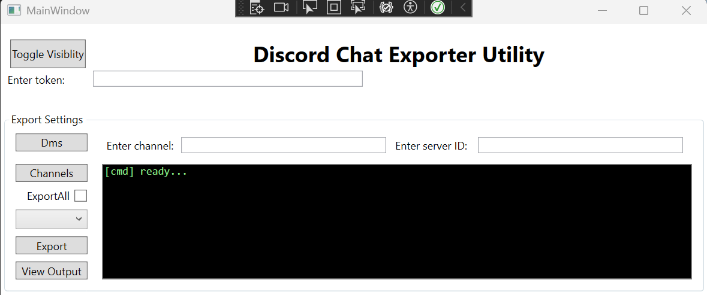

# Discord Chat Exporter GUI implementation using .NET 10 WPF

This project is based on https://github.com/Tyrrrz/DiscordChatExporter.

Lots of references would be made to the original project, and I would like to thank the author for his great work.

This project is a GUI implementation of the original project, which is a command-line tool. The GUI is built using .NET 10 WPF, and it provides a user-friendly interface for exporting Discord chat logs.

The reason for this project to exist, is due to a project that needed to export a large number of Discord chat logs, with integration of the WPF gui it already has.

# Features

* Authentication via either a user or a bot token
* Multiple output formats: HTML (dark/light), TXT, CSV, JSON
* Support for markdown, attachments, embeds, emoji, and other rich media features
* File partitioning, date ranges, message filtering, and other export options
* Self-contained exports that can be viewed offline

# Usage

## Gather user/bot token

For retrieving dm / server channels you need to provide a user token, for retrieving channels of a bot you need to provide a bot token.

To extract the token, from which there are various methods, look at the following URL: https://github.com/Tyrrrz/DiscordChatExporter/blob/prime/.docs/Token-and-IDs.md

---
## Gather server ID

Go to the server you want to export, right click on the server icon, and at the bottom of the list click "Copy ID". If you don't see the "Copy ID" option, you need to enable Developer Mode in your Discord settings.

---
## Recommendations

It is recommended to export single channels at a time, as exporting multiple channels at once may cause issues with rate limits and may result in incomplete exports or exports that take a while to download.

# Screenshots

